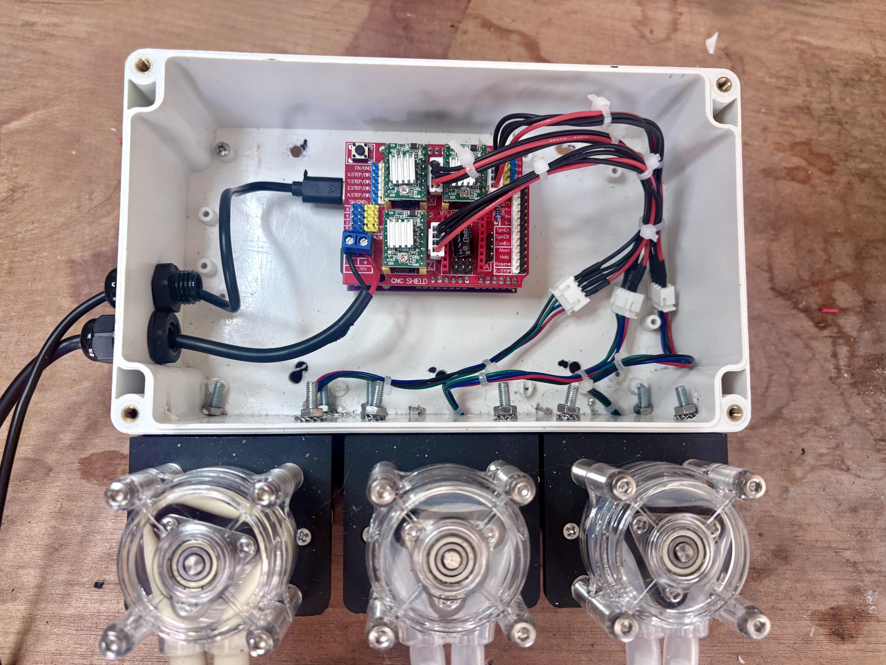

# GrowDose

**Open-source automated nutrient dosing system for hydroponic and grow-room automation.**

GrowDose is a three-channel dosing system built around an ESP32-S3, CNC Shield and A4988 stepper motor drivers. It is designed to provide accurate, repeatable nutrient and pH dosing while integrating into existing home automation ecosystems like Home Assistant.



## Why GrowDose?

GrowDose is designed as a **volume-controlled dosing system**, rather than simply switching pumps on and off for a fixed period of time.

Many DIY hydroponic controllers use relay or PWM-controlled DC peristaltic pumps and determine the dose primarily by running the pump for a calculated amount of time. GrowDose instead uses **stepper motors** to drive peristaltic pumps with precise, repeatable step counts.

Each pump will be individually calibrated to determine its actual **steps-per-ml**. This allows dosing commands to be expressed in millilitres rather than pump run time.

The intended architecture is:

**Home Assistant → ESPHome → GrowDose → calibrated stepper pump → measured volume**

This makes GrowDose a dedicated dosing actuator that can be integrated into a larger grow-room automation system while keeping the physical dosing process independent from the higher-level automation logic.

## Key Goals

* Accurate, repeatable volume-based dosing
* Independent calibration for each pump
* Three independent dosing channels
* Software-controlled motor enable/disable
* ESPHome and Home Assistant integration
* Open hardware and firmware
* Simple, reproducible construction
* Dosing history and usage tracking

## Hardware

* ESP32-S3 UNO-format development board
* CNC Shield V3
* 3 × A4988 stepper drivers
* 3 × stepper dosing pumps
* 12 V DC power supply
* JST pump connections and extension leads

## Controller Pinout

| Function            |   GPIO |
| ------------------- | -----: |
| Pump A STEP         | GPIO18 |
| Pump A DIR          | GPIO20 |
| Pump B STEP         | GPIO17 |
| Pump B DIR          |  GPIO3 |
| Pump C STEP         | GPIO19 |
| Pump C DIR          | GPIO14 |
| Shared A4988 ENABLE | GPIO21 |

## Microstepping

All three A4988 drivers are currently configured for **1/8 microstepping**:

| Setting | State |
| ------- | ----- |
| M0      | ON    |
| M1      | ON    |
| M2      | OFF   |

With a typical 200-step/revolution stepper motor this gives:

**1600 steps per revolution**

## Current Status

The hardware platform has been successfully tested:

* ESP32-S3 controller operating correctly
* CNC Shield operating correctly
* All three A4988 drivers operating correctly
* All three pumps operating correctly
* All three pumps tested in forward and reverse
* Shared driver enable control working
* Pumps de-energise when not dosing

## Development Roadmap

1. **Hardware testing** — Complete
2. **Pump calibration** — Next
3. **ESPHome stepper implementation**
4. **Steps-per-ml dosing control**
5. **Priming and dosing functions**
6. **Dosing safety limits**
7. **Home Assistant integration**
8. **Dosing history and usage tracking**
9. **Full system validation**

## Project Structure

```text
GrowDose/
├── README.md
├── CHANGELOG.md
├── Hardware
├── esphome/
│   └── nutrient-doser.yaml
├── hardware/
│   └── images/
└── docs/
```

## Documentation

* [Hardware Bill of Materials](Hardware)
* [Changelog](CHANGELOG.md)

## Project Status

GrowDose is currently at the **hardware validation stage**. The three-pump platform is operational and the next major step is calibrating each pump to establish accurate steps-per-ml values.

The project is being developed incrementally, with hardware reliability and repeatable dosing established before adding automated nutrient dosing logic.
